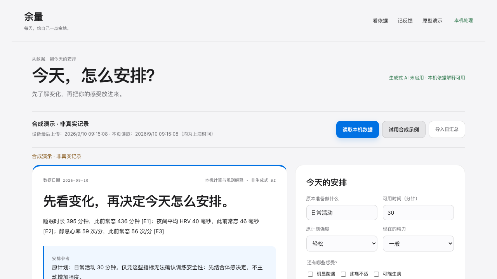

# Yuliang · 余量

> Turn wearable data into one explainable decision for today — with your own condition allowed to overrule the device.

[中文](README.md) · [Public-value review](docs/PUBLIC_RELEASE.md) · [Data adapters](docs/ADAPTERS.md)

**[Try the interactive demo →](https://zhuyep.github.io/yuliang/?lang=en)** · [中文在线试用](https://zhuyep.github.io/yuliang/?lang=zh)

No install or account. Switch between tiredness, a missing record, and discomfort to see how one suggestion changes. The online demo uses synthetic data only; use the local app below for your own daily summaries.

[](https://github.com/zhuyep/yuliang/actions/workflows/quality.yml)
[](LICENSE)
[](#privacy-and-safety-boundaries)

Yuliang is not another Garmin dashboard and it is not an AI doctor. It focuses on a narrower daily question: **when sleep, HRV, resting heart rate, and how you feel have changed, should you adjust the activity you already planned?**



_The screenshot is generated entirely from synthetic data._

## The missing layer

| Common tool | Main question | What Yuliang adds |
| --- | --- | --- |
| Collector / API | How do I retrieve the data? | No login or sync; accepts a local daily summary |
| Trend dashboard | What happened recently? | Gives one decision first, then exposes its evidence |
| General AI coach | What else can be generated? | Rules come first; missing data and discomfort can block advice |

Each reading shows dates, valid history coverage, personal medians, and evidence IDs. Pain, possible illness, and the user's own judgment take priority over a device score. Adoption and outcome feedback stay on the local machine. Generative AI is off by default; the core flow works without it.

## Try it in 60 seconds

Requires Node.js 22.13 or later. There are no third-party runtime dependencies, accounts, or package-install step.

The `private: true` field in `package.json` only prevents accidental npm publication; it does not mean the GitHub repository is private.

```sh
git clone https://github.com/zhuyep/yuliang.git
cd yuliang
npm run dev
```

Open <http://127.0.0.1:4173> and select **试用合成示例** (Try synthetic example). You can then inspect the E1–E5 evidence, change the planned activity or check-in, ask why, and record a decision. Demo feedback is never persisted.

Before submitting code:

```sh
npm run check
```

## Data inputs

The public core starts with synthetic examples and user-selected daily-summary JSON. Imports are processed in local server memory and are not persisted unless the user explicitly saves feedback. See [`docs/daily-summary.schema.json`](docs/daily-summary.schema.json) and [`docs/ADAPTERS.md`](docs/ADAPTERS.md).

An experimental read-only adapter is available for people who already run a compatible garmin-grafana-style InfluxDB locally:

```sh
YULIANG_DATA_SOURCE=garmin-grafana-influxdb npm run dev
```

It reads an existing local database only. It does not install a collector, log in to Garmin, trigger synchronization, or expose database credentials to the browser or a model. Set `YULIANG_GARMIN_DB_CONTAINER` when the container has a different name. This compatibility adapter is neither an official Garmin API integration nor a multi-user authorization solution.

## Privacy and safety boundaries

- The service binds to `127.0.0.1` and serves an explicit static-file allowlist.
- No cloud service or usage telemetry is enabled by default.
- Saved feedback lives outside the repository in a local user-state directory; demo feedback is not stored.
- Missing, stale, and insufficient-history states remain explicit and do not become zero or confident training adjustments.
- Pain or possible illness overrides device data. Outputs are not medical advice, diagnosis, or a medical-device function.
- The optional Ollama explainer is disabled by default. It can explain existing evidence but receives no account credentials, GPS data, or tool access.

Read the [local and model boundaries](docs/LOCAL_INSIGHTS.md), [architecture](docs/ARCHITECTURE.md), and [security policy](SECURITY.md).

## Status

This is a `v0.2.0` public preview. Deterministic analysis, synthetic demo, JSON import, local feedback, and the experimental database adapter have automated coverage. The project does **not** yet provide clinically validated rules, official Garmin authorization, automatic sync, activity write-back, or a production-validated local model. External usefulness and continued use are still unverified; stars are not evidence of health benefit.

Maintainer dogfooding continues under [`DOGFOOD.md`](DOGFOOD.md). See the [`ROADMAP`](docs/ROADMAP.md).

## Independent implementation and contributing

This repository is independently implemented and is not a fork of garmin-grafana or another health project. Before public release, its full Git history, long-line code overlap, third-party notices, and synthetic-data boundary were reviewed. The method and residual uncertainty are documented in [`docs/PUBLIC_RELEASE.md`](docs/PUBLIC_RELEASE.md). Generic metric and database field names are used for interoperability and do not imply source reuse.

Good first contributions include another local export format, a missing/stale-data boundary test, or a privacy-safe example of an unclear explanation. Read [`CONTRIBUTING.md`](CONTRIBUTING.md) and [`THIRD_PARTY_NOTICES.md`](THIRD_PARTY_NOTICES.md) first.

Yuliang is released under the [MIT License](LICENSE). Garmin, Garmin Connect, Body Battery, and associated marks belong to their respective owners. This project is not affiliated with, sponsored by, or endorsed by Garmin.
